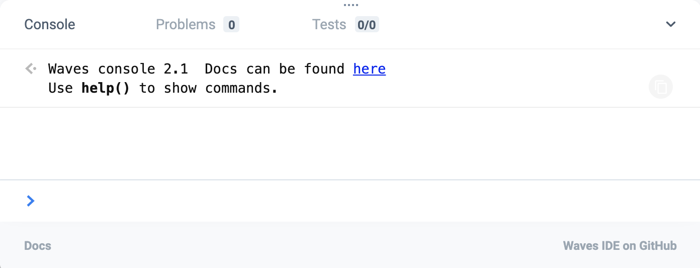

# REPL

**REPL** ([_read–eval–print loop_](https://en.wikipedia.org/wiki/Read%E2%80%93eval%E2%80%93print_loop)) is a console of the [Acryl IDE](/smart-contracts/tools/acryl-ide.md).

You can write in the console any JavaScript code.

The console has built-in functions which you can use to:

* sign and send [transactions](/blockchain/transaction.md)
* get account balance
* read data from [account data storage](/blockchain/account/account-data-storage.md)

The documentation on the console functions is available on [GitHub](https://acrylplatform.github.io/js-test-env).
